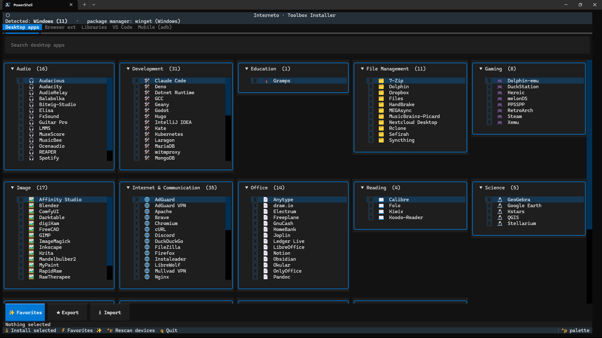

# Interneto · Toolbox Installer (TUI)

A cross-platform terminal app that brings the Interneto toolbox installers to
your terminal. It **autodetects your operating system and package manager**,
lets you multi-select packages just like the web UI, and then **actually runs the
install** instead of handing you a command to copy/paste.

## What it installs

| Surface            | How it installs                                                                                              | Availability                   |
|--------------------|--------------------------------------------------------------------------------------------------------------|--------------------------------|
| Desktop apps       | Native package manager (`pacman`, `apt`, `dnf`, `emerge`, `pkg`, `brew`, `winget`, `flatpak`, `snap`, `nix`) | Autodetected desktop OS        |
| Libraries          | Per-language manager (`npm`, `pip`, …)                                                                       | Desktop                        |
| VS Code extensions | `code --install-extension`                                                                                   | Desktop (needs the `code` CLI) |
| Browser extensions | Downloads the `.xpi` (Firefox) / `.crx` (Chromium) and opens it so the browser installs it                   | Desktop                        |
| Mobile (Android)   | Deep-links each Play Store page on a connected device over `adb`                                             | When a device is attached      |

The package lists are the **same JSON** the web toolbox ships in its
`public/pkgs/`, bundled into the app. Re-sync them from a sibling
`interneto-website/` checkout via `python scripts/sync_pkgs.py`.

## Install & run

**One-liner** (installs [uv](https://docs.astral.sh/uv/) if needed, then the app from GitHub, then launches it):

```powershell
# Windows (PowerShell)
irm https://raw.githubusercontent.com/interneto/tui-toolbox-installer/main/scripts/install.ps1 | iex
```

```bash
# macOS / Linux
curl -fsSL https://raw.githubusercontent.com/interneto/tui-toolbox-installer/main/scripts/install.sh | sh
```

Already have **uv**? Skip the bootstrap:

```bash
uvx --from git+https://github.com/interneto/tui-toolbox-installer interneto-install   # run once, no install
uv tool install git+https://github.com/interneto/tui-toolbox-installer                # install the command
```

**From a local checkout** (development):

```bash
python -m venv .venv && . .venv/bin/activate   # Windows: .venv\Scripts\activate
pip install -e .
interneto-install            # launch the TUI
interneto-install --detect   # just print what was autodetected
```

Re-running either one-liner upgrades to the latest version.

## Keys

- Packages are grouped into collapsible category sections (with an icon per row),
  laid out in a responsive grid of up to five columns. Sections are expanded by
  default; collapse a header to tuck a category away.
- Type to search, `space` to toggle a package, `enter` to expand/collapse a section, arrows to move.
- `i` — install the selected packages in the active tab (shows the exact commands first).
- `f` / **✨ Favorites** — select this section's favorite packages in one go.
- `Ctrl+R` — rescan for Android devices.
- `q` — quit.

## Favorites

The **✨ Favorites** button (or `f`) selects a curated set of packages for the
active tab. Each surface (desktop, VS Code, libraries, browser, mobile) has its
own list. The shipped defaults live in `interneto_install/data/favorites.json`.

Make them your own:

- **★ Export** writes the current tab's selection as the favorites for that
  surface to a per-user config file (`<config dir>/interneto-install/favorites.json`,
  e.g. `%APPDATA%\interneto-install\` on Windows). Other surfaces are preserved.
- **⭳ Import** reloads that file (handy after editing it by hand) and applies the
  active tab's favorites. When the file is absent, the bundled defaults are used.

## Notes

- Desktop installs use your system package manager and may prompt for `sudo`.
  The app always shows the exact commands and asks for confirmation before running.
- Browser extensions are downloaded as `.xpi` (Firefox, from addons.mozilla.org)
  or `.crx` (Chromium, from Google's update service) into your Downloads folder,
  then opened so the browser runs its own install prompt. Firefox asks you to
  confirm the add-on; Chrome may refuse a `.crx` that didn't come from the Web Store.
- Android apps can't be silently installed from the CLI, so that surface opens the
  official Play Store pages for the final one-tap install.

## Screenshot


